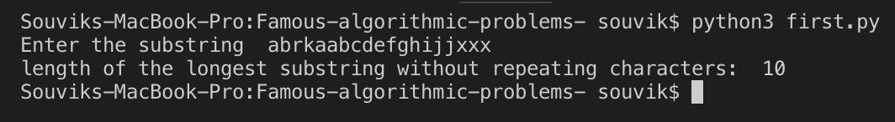

# Famous-algorithmic-problems-
Solutions to some famous algorithmic problems often asked in interviews.

1. [Given a string, find the length of the longest substring without repeating characters.]()

